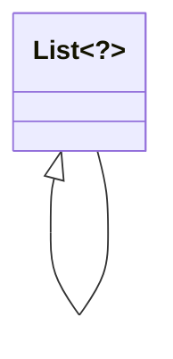

```mermaid
classDiagram
    direction TB

    class `List~?~`
    class `List~? extends Number~`
    class `List~? extends Integer~`
    class `List~? super Integer~`
    class `List~? super Number~`
    class `List~Number~`
    class `List~Integer~`
    class `List~Object~`

    `List~?~` <|-- `List~? extends Number~`
    `List~?~` <|-- `List~? super Integer~`

    `List~? extends Number~` <|-- `List~? extends Integer~`
    `List~? extends Number~` <|-- `List~Number~`

    `List~? extends Integer~` <|-- `List~Integer~`

    `List~? super Integer~` <|-- `List~? super Number~`
    `List~? super Integer~` <|-- `List~Integer~`

    `List~? super Number~` <|-- `List~Number~`
    `List~? super Number~` <|-- `List~Object~`
```