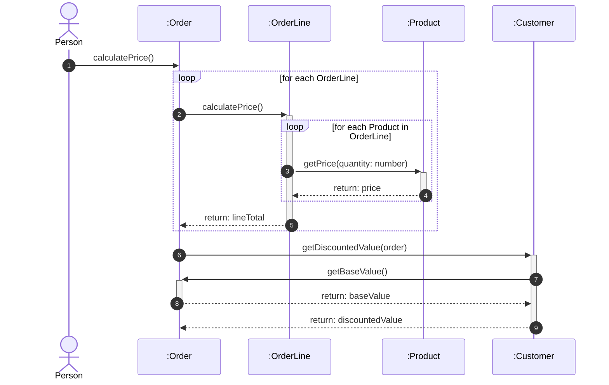

```mermaid
sequenceDiagram
    autonumber

    actor Person
    participant Order as :Order
    participant Orderline as :OrderLine
    participant Product as :Product
    participant Customer as :Customer

    Person ->> Order: calculatePrice()

    loop for each OrderLine
        Order ->>+ Orderline: calculatePrice()

        loop for each Product in OrderLine
            Orderline ->>+ Product: getPrice(quantity: number)
            Product -->>- Orderline: return: price
        end

        Orderline -->>- Order: return: lineTotal
    end

    Order ->>+ Customer: getDiscountedValue(order)
    Customer ->>+ Order: getBaseValue()
    Order -->>- Customer: return: baseValue
    Customer -->>- Order: return: discountedValue
```
