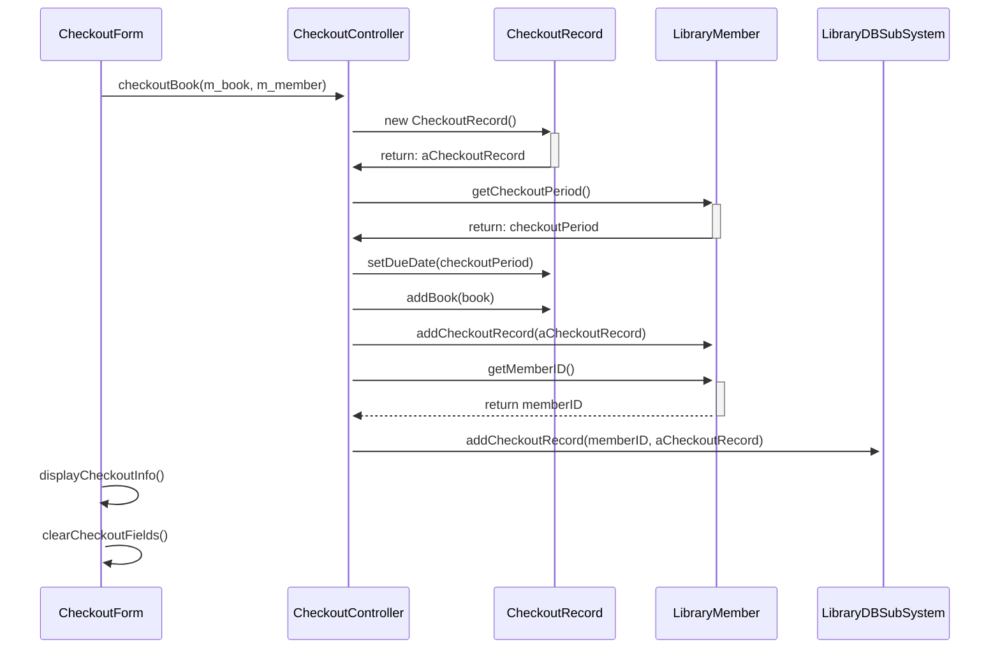
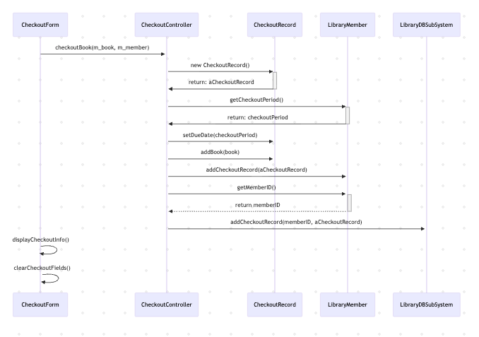

```mermaid
sequenceDiagram 
    CheckoutForm ->>+ CheckoutController: checkoutBook(m_book,  m_member)
    CheckoutController ->>+ CheckoutRecord: new CheckoutRecord()
    CheckoutRecord ->>- CheckoutController: return: aCheckoutRecord
    CheckoutController->>+ LibraryMember: getCheckoutPeriod()
    LibraryMember ->>-CheckoutController:  return: checkoutPeriod
    CheckoutController ->>+ CheckoutRecord: setDueDate(checkoutPeriod)
    CheckoutController ->>+ CheckoutRecord: addBook(book)
    CheckoutController ->>+ LibraryMember: addCheckoutRecord(aCheckoutRecord)
    CheckoutController ->>+ LibraryMember: getMemberID()
    LibraryMember -->>- CheckoutController: return memberID
    CheckoutController ->>+ LibraryDBSubSystem: addCheckoutRecord(memberID, aCheckoutRecord)
    CheckoutForm ->>+ CheckoutForm: displayCheckoutInfo()
    CheckoutForm ->> CheckoutForm: clearCheckoutFields()
```
