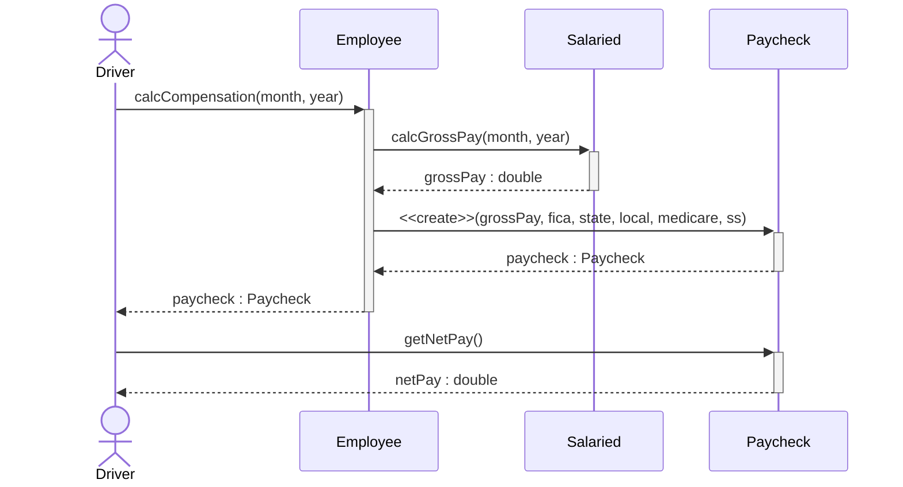

```mermaid 
sequenceDiagram
    actor Driver
    Driver ->>+ Employee: calcCompensation(month, year)
    Employee ->>+ Salaried: calcGrossPay(month, year)
    Salaried -->>- Employee: grossPay : double
    Employee ->>+ Paycheck: <<create>>(grossPay, fica, state, local, medicare, ss)
    Paycheck -->>- Employee: paycheck : Paycheck
    Employee -->>- Driver: paycheck : Paycheck
    Driver ->>+ Paycheck: getNetPay()
    Paycheck -->>- Driver: netPay : double
```