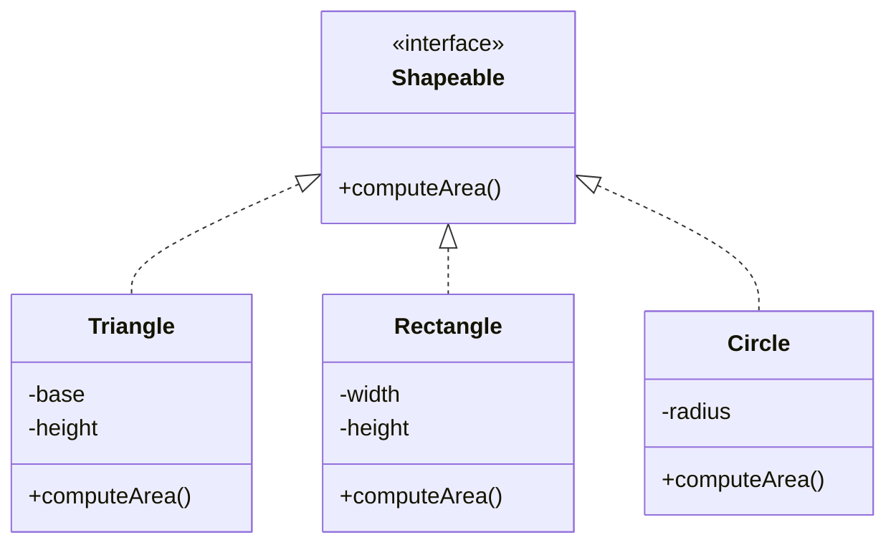

```mermaid
classDiagram
%% Interface
class Shapeable {
    <<interface>>
    +computeArea()
}
%% Implementation
class Triangle{
    -base
    -height
    +computeArea()
}

class Rectangle{
    -width
    -height
    +computeArea()
}

class Circle{
    -radius
    +computeArea()
}

Shapeable <|..Triangle
Shapeable <|..Rectangle
Shapeable <|..Circle

```