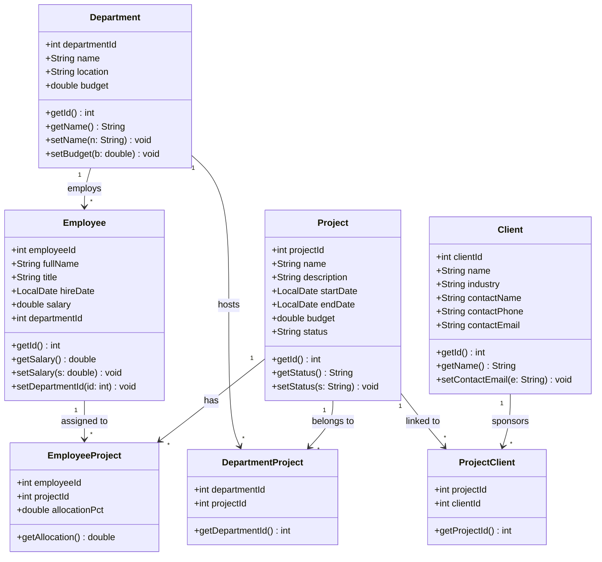

```mermaid
classDiagram
  class Department {
    +int departmentId
    +String name
    +String location
    +double budget
    +getId() int
    +getName() String
    +setName(n: String) void
    +setBudget(b: double) void
  }
  class Employee {
    +int employeeId
    +String fullName
    +String title
    +LocalDate hireDate
    +double salary
    +int departmentId
    +getId() int
    +getSalary() double
    +setSalary(s: double) void
    +setDepartmentId(id: int) void
  }
  class Project {
    +int projectId
    +String name
    +String description
    +LocalDate startDate
    +LocalDate endDate
    +double budget
    +String status
    +getId() int
    +getStatus() String
    +setStatus(s: String) void
  }
  class Client {
    +int clientId
    +String name
    +String industry
    +String contactName
    +String contactPhone
    +String contactEmail
    +getId() int
    +getName() String
    +setContactEmail(e: String) void
  }
  class EmployeeProject {
    +int employeeId
    +int projectId
    +double allocationPct
    +getAllocation() double
  }
  class DepartmentProject {
    +int departmentId
    +int projectId
    +getDepartmentId() int
  }
  class ProjectClient {
    +int projectId
    +int clientId
    +getProjectId() int
  }

  Department "1" --> "*" Employee : employs
  Department "1" --> "*" DepartmentProject : hosts
  Project "1" --> "*" DepartmentProject : belongs to
  Employee "1" --> "*" EmployeeProject : assigned to
  Project "1" --> "*" EmployeeProject : has
  Project "1" --> "*" ProjectClient : linked to
  Client "1" --> "*" ProjectClient : sponsors

```