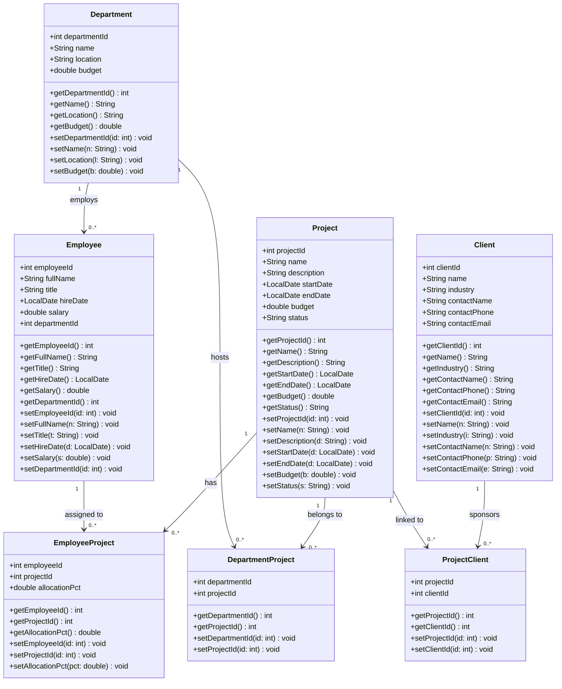
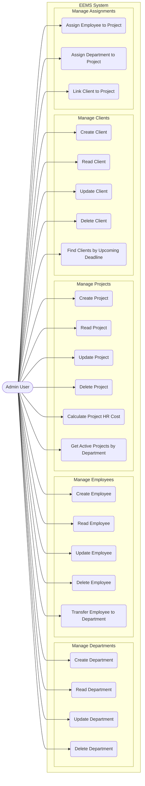
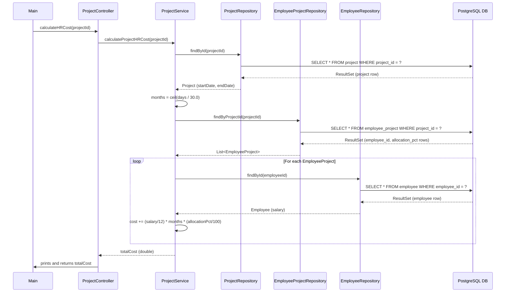

## 1. UML Class Diagram

---

## 2. Use Case Diagram

---

## 3. Sequence Diagram 

---

## 4. Database Schema

### Tables Overview

| Table | Type | Description |
|---|---|---|
| `department` | Core | Organizational units |
| `employee` | Core | Workforce members (FK → department) |
| `project` | Core | Operational tasks |
| `client` | Core | External sponsors |
| `employee_project` | Junction (M:M) | Employee ↔ Project with allocation % |
| `department_project` | Junction (M:M) | Department ↔ Project hosting |
| `project_client` | Junction (M:M) | Project ↔ Client sponsorship |

---
